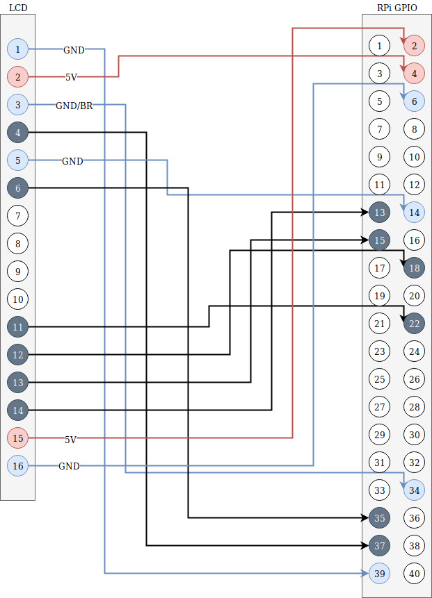
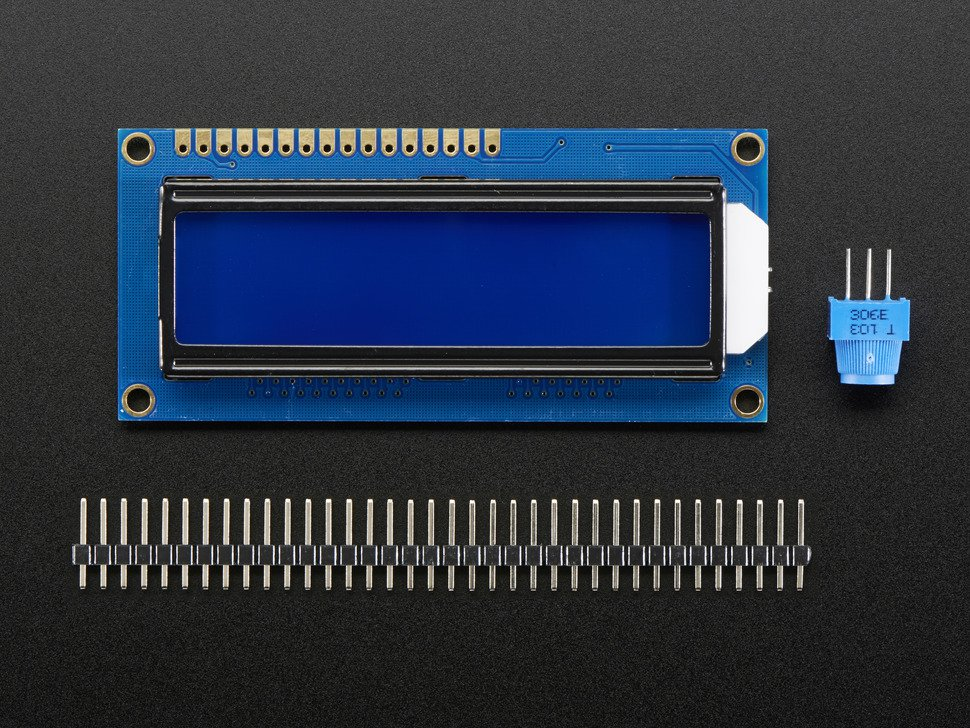

# RPI TEMPERATURE DISPLAY 
#### Using an RPI and a char LCD displays the current temperature, and updates it periodically through python weather API

# Instructions
1. `sudo apt-get update`
2. `sudo apt-get -y install python3-pip`
3. `pip3 install -r requirements.txt`
4. `make`

# Schematic

| LED PIN# | GPIO PIN# | GPIO NAME |
|----------|-----------|-----------|
| 1        | 39        | Ground    |
| 2        | 4         | DC 5V     |
| 3        | 34        | Ground    |
| 4        | 37        | GPIO26    |
| 5        | 14        | Ground    |
| 6        | 35        | GPIO19    |
| 11       | 22        | GPIO25    |
| 12       | 18        | GPIO24    |
| 13       | 15        | GPIO22    |
| 14       | 13        | GPIO27    |
| 15       | 2         | DC 5V     |
| 16       |  6        | Ground    |

# Hardware Used
1. [Raspberry Pi 3 Model B+](https://www.raspberrypi.org/products/raspberry-pi-3-model-b-plus/)
>  
2. [Standard HD44780 LCD](https://www.adafruit.com/product/181)
>  

# To run on RPi startup
1. `crontab -e`
2. Append to end of the file : `@reboot python3 <path>/src/pytemp.py`
3. Replace `<path>` with the full pathname of the repo
4. `sudo raspi-config` > 3. Boot Options > B1. Desktop/CLI > B2. Console Autologin
5. `sudo reboot`

# Resources
[Guide and Schematic ](https://learn.adafruit.com/character-lcds/python-circuitpython)
[Python Weather API](https://pypi.org/project/weather-api/)
